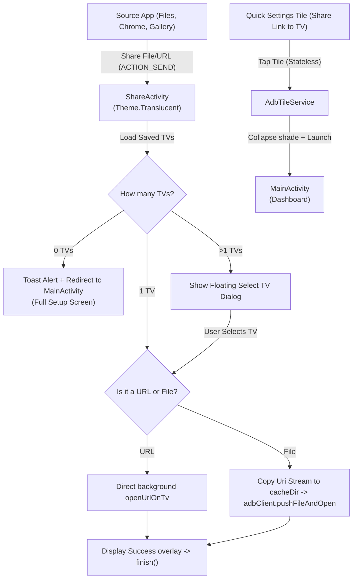

# 📺 Share Link to TV


<div align="center">
  
  
  
  
  
</div>

<p align="center">
  <b>A lightweight, high-performance Android utility to instantly cast web links, APK packages, images, videos, and documents from your phone directly to your Android TV over ADB (TCP).</b>
  <br />
  <i>Requires zero TV-side companion apps, runs completely stateless via a Quick Settings Tile, and keeps your launcher clean.</i>
</p>

---

## 🚀 Key Features

* 🔍 **Local TV Auto-Discovery (mDNS)**: Scan your local network on-demand for active ADB (`_adb._tcp`) and Google Cast (`_googlecast._tcp`) TV services using native Android `NsdManager`. Scan operations are entirely manual (Start/Stop buttons) to completely eliminate background startup scanning overhead and guarantee instant, lightweight cold starts.
* 🚀 **Stateless Quick Settings Tile**: The app has **no home screen launcher icon**. It is launched directly from a dedicated notification bar Quick Settings tile, keeping your phone's app drawer clean.
* 📦 **Direct APK Streaming Installer**: Streams APK packages directly over the ADB socket using `dadb.install()`, completely bypassing TV storage restrictions and avoiding Android system server SELinux read-context errors.
* 📂 **Binary File Sharing**: Casts images, videos, audio tracks, and PDF documents to the TV's `/sdcard/Download` folder and automatically fires the corresponding view intent on the TV screen.
* 🔗 **Smart Link Extraction**: Extracts and sanitizes clean URLs from messy share text (e.g. sharing from YouTube or Chrome containing titles and tracking strings).
* 🔄 **Direct Background Sharing**:
  * If **1 TV** is saved: Sends URLs or files instantly in the background with a minimal translucent progress card.
  * If **multiple TVs** are saved: Displays a beautiful floating translucent selection overlay to target a specific TV.
* 🛡️ **Self-Healing Key Exchange**: Generates and persists a local ADB RSA keypair securely in the phone's private files folder, prompting TV authorization once and recovering gracefully if key corruption occurs.
* 🎹 **Keyboard (IME) Padding**: Fully adaptive layout that automatically scales and shifts input forms when the system keyboard rises.
* ⚡ **Zero TV Dependencies**: Works on any Android TV out-of-the-box simply by enabling ADB Network Debugging in settings.

---

## 🛠️ TV Setup Required

To allow your phone to communicate with your TV, you must enable network debugging on your Android TV:

1. On your TV, go to **Settings → Device Preferences → About**.
2. Scroll down to **Build** and click it **7 times** until you see the toast: *"You are now a developer!"*
3. Go back and open **Developer Options**.
4. Enable **Network debugging** (or *ADB over TCP*).
5. Ensure your phone and TV are connected to the **same Wi-Fi network**.

---

## 📱 How to Use the App

### 1. Opening the App & Quick Settings Shortcut
Because the app hides its launcher icon to keep your app drawer completely clean, there are two ways to open the configuration dashboard:

#### Option A: Quick Settings Tile (Recommended)
1. Swipe down twice from the top of your screen to expand the full Quick Settings panel.
2. Tap the **Edit (pencil)** icon.
3. Scroll down, locate the **Share Link to TV** tile, and drag it into your active settings tray.
4. Tap the tile to launch the main dashboard.

#### Option B: System Settings (App Info)
1. Open your device's system **Settings**.
2. Navigate to **Apps** (or **Apps & notifications**).
3. Search for or select **Share Link to TV**.
4. Tap **Open** at the top of the App Info page.

### 2. Pairing & Saving Devices
1. When you open the dashboard, tap the **Play (Scan)** button next to the **Discovered on Wi-Fi** section header to begin scanning your Wi-Fi network. Discovered TVs will appear in the list. Tap **Stop** at any time to pause scanning and conserve battery.
2. Tap **Save** next to a discovered TV. The input form will pre-fill with its host and port.
3. Choose a custom name (e.g. *"Living Room TV"*) and click **Save TV**.
4. Tap **Test** on your saved TV card. A prompt will appear on your TV screen asking to allow USB/Network Debugging. Check **"Always allow from this computer"** and select **OK**.

### 3. Sharing Links & Files
* **Casting a Link**: Open Chrome, YouTube, or any app. Select **Share**, choose **Share Link to TV**, select your TV, and the link will open in the TV's default browser or matching app.
* **Casting a File**: Open your file manager or gallery, select an image, video, document, or APK file, tap **Share**, and choose **Share Link to TV**. APKs will install automatically; media files will be pushed to the TV and opened on screen.

---

## 🏗️ Architecture & Data Flow



---

## 🛠️ Build and Compilation

The project is built with Jetpack Compose, Material 3, and utilizes the pure Kotlin `dadb` library (no external ADB binary or server processes are run on the phone).

### Prerequisites
* JDK 17+
* Android SDK (API 24+)

### Building from Command Line
To compile and generate the debug APK, run:
```bash
./gradlew assembleDebug
```
The output binary will be generated at:
`app/build/outputs/apk/debug/app-debug.apk`

### Installing on a Connected Device
```bash
./gradlew installDebug
```

---

## 📄 License
This project is open-source and available under the [MIT License](LICENSE).
